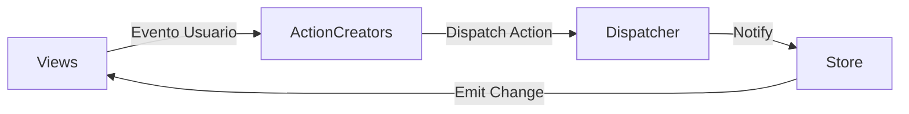
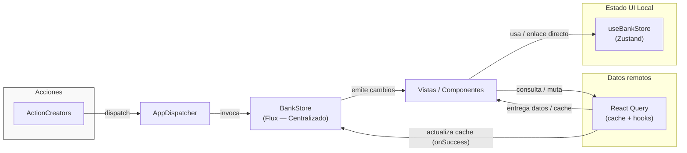

# NeoBank — Prototipo de Aplicación Financiera React


> Prototipo que simula el flujo crítico de transferencias bancarias para validar hipótesis de UX cognitiva en banca digital. Implementa una arquitectura de estado híbrida (Flux + Zustand + React Query) que garantiza verdad financiera de datos y separación de responsabilidades clara.
>
> **Contexto académico:** Actividad Sumativa — Unidad 3

---

## 📑 Tabla de Contenidos

- [Tecnologías](#-tecnologías-principales)
- [Arquitectura](#️-arquitectura-del-sistema)
- [Decisiones de Diseño](#-decisiones-de-diseño)
- [Características UX/UI](#-características-uxui)
- [Estructura del Proyecto](#-estructura-del-proyecto)
- [Configuración y Ejecución](#️-configuración-y-ejecución)
- [Testing](#-testing)
- [Autor](#-autor)

---

## 🚀 Tecnologías Principales

| Tecnología | Versión | Propósito |
|---|---|---|
| [React](https://reactjs.org/) + [Vite](https://vitejs.dev/) | 18 / 5 | Framework UI + bundler |
| [TypeScript](https://www.typescriptlang.org/) | 5 | Tipado estático |
| Patrón **Flux** (custom) | — | Estado central y lógica contable |
| [Zustand](https://zustand-demo.pmnd.rs/) | 4 | Estado efímero de UI |
| [React Query](https://tanstack.com/query/latest) | 5 | Caché y sincronización de datos remotos |
| [Tailwind CSS](https://tailwindcss.com/) | 3 | Estilos utilitarios |
| Capa de Mocks | — | Simulación de API con latencia controlada |

---

## 🏛️ Arquitectura del Sistema

El proyecto implementa un modelo de estado híbrido en tres niveles, cada uno con una responsabilidad exclusiva.

### Flujo Flux (Capa de Negocio)

Garantiza un flujo de datos unidireccional y predecible, esencial en aplicaciones financieras donde la consistencia del saldo es crítica.



- **[Dispatcher.ts](src/flux/Dispatcher.ts):** Centralizador de acciones — punto único de entrada al store.
- **[BankStore.ts](src/flux/BankStore.ts):** Único origen de la verdad para saldos y transacciones.
- **[ActionCreators.ts](src/flux/ActionCreators.ts):** Encapsulan la lógica asíncrona y despachan acciones tipadas.
- **Views (React):** Suscritas al store vía [`useBankStoreHook.ts`](src/hooks/useBankStoreHook.ts).

### Modelo Híbrido Completo



---

## 🧠 Decisiones de Diseño

### ¿Por qué Flux y no Redux?
Flux refuerza el flujo unidireccional puro sin el boilerplate de reducers/slices de Redux. Para un prototipo financiero donde la trazabilidad de acciones es prioritaria, esta simplicidad reduce el riesgo de mutaciones accidentales de estado.

### ¿Por qué Zustand para el UI state?
El wizard de transferencia necesita estado efímero (paso actual, selección temporal de destinatario) que no debe contaminar el store central de negocio. Zustand provee esto con mínima superficie de API.

### ¿Por qué React Query?
Gestiona la capa de datos remotos con caché automática, deduplicación de peticiones e invalidación. Evita que ActionCreators tengan que orquestar manualmente el ciclo fetch → loading → error → data.

---

## 💎 Características UX/UI

El wizard de transferencia aplica principios de UX cognitiva para minimizar errores del usuario:

| Paso | Funcionalidad | Principio aplicado |
|---|---|---|
| 1. Destinatario | Filtro de búsqueda + sección de favoritos | **Ley de Hick** — reduce opciones visibles |
| 2. Monto | Validación de saldo en tiempo real + límites | Feedback inmediato |
| 3. Confirmación | Resumen completo antes del envío | **Ley de Miller** — agrupa información en chunks |
| Resultado | Comprobante con ID único + estados de carga (skeleton/spinner) | Diseño de feedback de error |

> **Hipótesis de diseño:** Separar la selección de destinatario de la captura de monto reduce errores de transferencia al destino equivocado, al crear un punto de confirmación explícito en cada dimensión de la operación.

---

## 📁 Estructura del Proyecto

```
src/
├── components/                # Componentes React del wizard
│   ├── TransferWizard.tsx         # Orquestador principal del flujo
│   ├── StepRecipient.tsx          # Paso 1: selección de destinatario
│   ├── StepAmount.tsx             # Paso 2: captura y validación de monto
│   ├── StepConfirm.tsx            # Paso 3: confirmación y envío
│   └── TransferWizard.test.tsx
├── flux/                      # Implementación del patrón Flux
│   ├── Dispatcher.ts
│   ├── ActionTypes.ts
│   ├── ActionCreators.ts
│   └── BankStore.ts
├── store/                     # Estado UI efímero (Zustand)
│   └── useBankStore.ts
├── hooks/                     # Custom hooks de integración
│   ├── useBankStoreHook.ts        # Suscripción al BankStore (Flux)
│   └── useServerData.ts           # Integración con React Query
├── mocks/                     # Simulación de API con latencia
│   └── api.ts
├── styles/                    # Clases Tailwind centralizadas
│   └── tailwindClasses.ts
└── test/
    └── setup.ts               # Configuración global de tests
```

---

## 🛠️ Configuración y Ejecución

### Requisitos Previos

- Node.js **≥ 18**
- npm **≥ 9**

### Instalación

```bash
npm install
```

### Desarrollo

```bash
npm run dev
```

### Construcción para producción

```bash
npm run build
```

---

## 🧪 Testing

El proyecto incluye tests de componentes con cobertura del flujo completo del wizard de transferencia.

```bash
# Ejecutar suite de tests
npm test

# Modo watch (desarrollo)
npm run test:watch
```

**Cobertura:** Tests unitarios e integración sobre `TransferWizard` y sus pasos, verificando flujo de pasos, validación de monto y despacho de acciones Flux.

---

## 👤 Autor

**Yeison Noreña Osorio**
