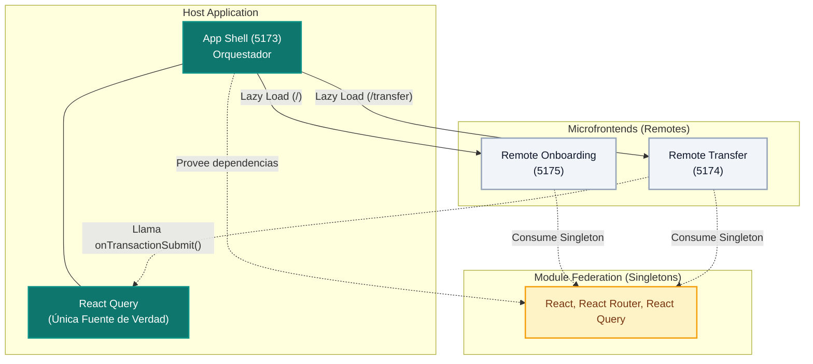

# NeoBank — Arquitectura de Microfrontends con Module Federation


> Prototipo bancario que simula flujos de incorporación (Onboarding) y transferencias. Migrado a una arquitectura escalable de **Microfrontends**, utilizando Module Federation para el desacoplamiento de dominios y React Query como única fuente de verdad (Server State).
>
> **Contexto académico:** Actividad Sumativa — Unidad 3

---

## 📑 Tabla de Contenidos

- [Tecnologías Principales](#-tecnologias-principales)
- [Arquitectura de Microfrontends](#-arquitectura-de-microfrontends)
- [Decisiones de Diseño](#-decisiones-de-diseno)
- [Estructura del Proyecto (Monorepo)](#-estructura-del-proyecto-monorepo)
- [Configuración y Ejecución](#-configuracion-y-ejecucion)
- [Testing](#-testing)
- [Autor](#-autor)

---

## 🚀 Tecnologías Principales

| Tecnología | Versión | Propósito |
|---|---|---|
| [React](https://reactjs.org/) + [Vite](https://vitejs.dev/) | 18 / 5 | Framework UI + bundler |
| [TypeScript](https://www.typescriptlang.org/) | 5 | Tipado estático estricto |
| [Module Federation](https://github.com/originjs/vite-plugin-federation) | 1.3 | Carga dinámica de módulos en tiempo de ejecución |
| [React Query](https://tanstack.com/query/latest) | 5 | Caché, sincronización de datos y estado global |
| [PNPM Workspaces](https://pnpm.io/) | — | Gestión del monorepo |
| [Tailwind CSS](https://tailwindcss.com/) | 3 | Estilos utilitarios y aislados por componente |

---

## 🏛️ Arquitectura de Microfrontends

El sistema ha evolucionado de un monolito a una arquitectura distribuida basada en dominios de negocio:



### 1. App Shell (Host)
Funciona como el orquestador principal. Mantiene la "Única Fuente de la Verdad" del saldo del usuario utilizando React Query y gestiona el enrutamiento global (`react-router-dom`). Implementa Error Boundaries para aislar interrupciones de sub-dominios.

### 2. Remote Onboarding (Dominio de Adquisición)
Microfrontend independiente responsable del flujo de creación de cuentas (Landing, Identidad, Seguridad y Confirmación). Utiliza React Hook Form y Zod para validaciones. Se expone dinámicamente al App Shell.

### 3. Remote Transfer (Dominio Transaccional)
Microfrontend enfocado en el `TransferWizard`, manejando la selección de destinatario, asignación de monto y validación financiera. Recibe los props de estado global (`balance`) inyectados explícitamente desde el Host.

### Comunicación entre Módulos
- **Contratos Fuertes:** Se comparte `@poli/shared-types` a través de todos los módulos para asegurar interfaces consistentes (`IShellProps`, `Transaction`).
- **Dependencies Sharing:** Librerías base (`react`, `react-dom`, `@tanstack/react-query`, `react-router-dom`) son configuradas como Singletons en la red de Module Federation, minimizando el tamaño final en el navegador y asegurando la estabilidad del Context en React.

---

## 🧠 Decisiones de Diseño

### ¿Por qué React Query en lugar del antiguo modelo Flux/Zustand?
Tener tres paradigmas conviviendo (Flux centralizado, Zustand efímero, React Query para fetch remoto) incrementaba la deuda técnica exponencialmente. React Query consolidó el *"Server State"* manejando la lógica transaccional de manera segura y proveyendo un caché central nativo para el Host y todos sus Módulos.

### Ruteo Inter-Aplicación
La navegación principal reside en el App Shell (`/` para Onboarding y `/transfer` para Transferencias). El Shell encapsula a los módulos dinámicos en componentes `<Suspense>` emparejados con su respectivo `<ErrorBoundary>`. Con esto se logra un "Graceful Degradation": si un remote no compila o colapsa, el otro 90% del portal seguirá funcional.

---

## 📁 Estructura del Proyecto (Monorepo)

```text
packages/
├── shell/                 # Orquestador Principal (Puerto 5173)
│   ├── src/App.tsx        # Rutas y Error Boundaries
│   └── vite.config.ts     # Configuración de Host Federation
├── remote-transfer/       # Módulo Transferencias (Puerto 5174)
│   ├── src/TransferWidget.tsx
│   └── vite.config.ts     # Configuración Remote Federation
├── remote-onboarding/     # Módulo Onboarding (Puerto 5175)
│   ├── src/OnboardingFlow.tsx
│   └── vite.config.ts     # Configuración Remote Federation
└── shared-types/          # Contratos TypeScript (Interfaces globales)
    └── src/index.ts
```

---

## 🛠️ Configuración y Ejecución

### Requisitos Previos

- Node.js **≥ 18**
- PNPM **≥ 8** (`npm install -g pnpm`)

### Instalación

En la raíz del proyecto, instala todas las dependencias del monorepo:

```bash
pnpm install
```

### Desarrollo

Levanta todos los microfrontends simultáneamente (Compila el paquete compartido de tipos, los remotes para generar el `remoteEntry.js` y luego levanta el Shell):

```bash
pnpm dev:all
```
* Acceso Principal (Shell): `http://localhost:5173`

### Construcción para Producción

Compila todo el ecosistema y remotes:

```bash
pnpm build:all
```

---

## 🧪 Testing

El ecosistema está construido con **Vitest** y **Testing Library**.

```bash
# Ejecutar tests sobre el App Shell
pnpm test:shell
```

---

## 👤 Autor

**Yeison Noreña Osorio**
